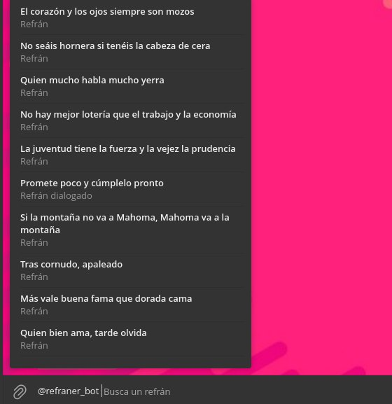
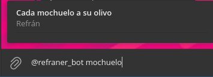

# RefranerBot

[@refraner_bot](https://t.me/refraner_bot)

Envía `/refran` al bot y el bot contestará con un refrán aleatorio

## Inline

Puedes usar el bot en cualquier chat con el el modo _inline_. Por defecto mostrará 10 refranes aleatorios

También puedes buscar un refrán

__Nota:__ _De momento la búsqueda es literal_
